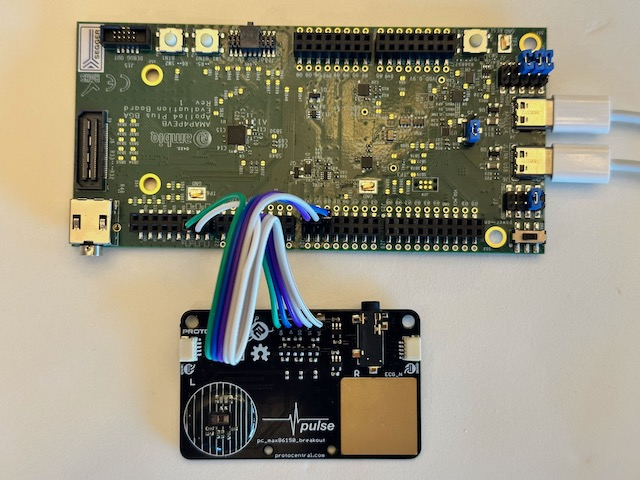

# EVB Demo

This demo shows running an end-to-end heart arrhythmia classifier on the Apollo 4 EVB. The basic flow chart is depicted below.

```mermaid
flowchart LR
    S[1. Collect] -->| | P[2. Preprocess] --> M[3. CNN] --> L[4. Display]
```

In the first stage, 5 seconds of sensor data is collected- either directly from the MAX86150 sensor or test data from the PC. In stage 2, the data is preprocessed by bandpass filtering and standardizing. The data is then fed into the CNN network to perform inference. Finally, in stage 4, the ECG data will be classified as normal, arrhythmia (AFIB) or inconclusive. Inconclusive is assigned when the prediction confidence is less than 90%.

> NOTE: The reference arrhythmia model has already been converted into TFLM model and located at `./evb/src/model.h`

## Software Setup

In order to compile the EVB binary, both [Arm GNU Toolchain](https://developer.arm.com/downloads/-/arm-gnu-toolchain-downloads) and [Segger J-Link](https://www.segger.com/downloads/jlink/) must be installed on the host PC. After installing, ensure they are both available from the terminal. (e.g `which arm-none-eabi-gcc`)

## Hardware Setup

### 1. Connect EVB to MAX86150 breakout

In order to connect the MAX86150 breakout board to the Apollo 4 EVB, we must first solder the 5-pin header on to MAX86150 board.

#### Option A: 5-pin Header


Once soldered, connect the breakout board to the EVB using 4 jumper wires as follows:

| Breakout    | Apollo 4 EVB      |
| ----------- | ----------------- |
| VCC         | J17 pin 2 (5V)    |
| SCL         | J11 pin 3 (GPIO8) |
| SDA         | J11 pin 1 (GPIO9) |
| GND         | J17 pin 4 (GND)   |



#### Option B: Qwiic Connector

Using a Qwiic breakout cable, connect the breakout board to the EVB

| Qwiic cable | Apollo 4 EVB      |
| ----------- | ----------------- |
| GND         | J3 pin 7 (GND)    |
| VCC         | J3 pin 5 (3_3V)   |
| SDA         | J11 pin 1 (GPIO9) |
| SCL         | J11 pin 3 (GPIO8) |

### 2. Connect EVB to host PC

Next, connect the EVB to your laptop using both USB-C ports on the EVB.

> NOTE: For a better quality ECG, it is recommended that the accompanying ECG cable be used with electrodes. Quality of ECG from the onboard pads depends on contact quality and will produce artifacts.

## Running the Demo

Please open two terminals to ease running the demo. We shall refer to these as __Terminal A__ and __Terminal B__.

### 1. Run client on EVB

Run the following commands in terminal A. This will compile the EVB binary and flash it to the EVB. The binary will be located in `./evb/build`.

```bash
make -C ./evb
make -C ./evb/ deploy
```

### 2. Run server on host PC

In terminal B, start the server on the PC.

```bash
python -m ecgarr evb_demo --config-file ./configs/evb-demo.json
```

Upon start, the server will scan and connect to the EVB serial port. If no port is detected after 30 seconds, the server will exit. If successful, the server should discover the USB port and say `Server running`.

### 3. Trigger start

Now that the EVB client and PC server are running, press Button 0 (BTN0) on the EVB to start the demo. In terminal A, the EVB should be printing the stage it's in (e.g INFERENCE) and any results. In terminal B, the PC should be printing results from the EVB.
